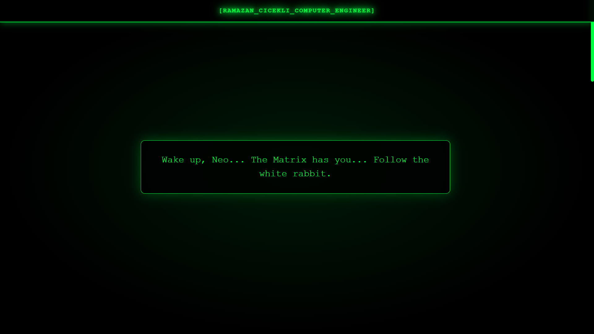
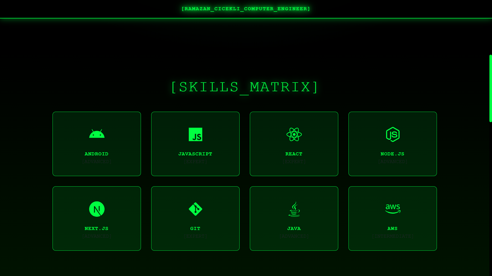
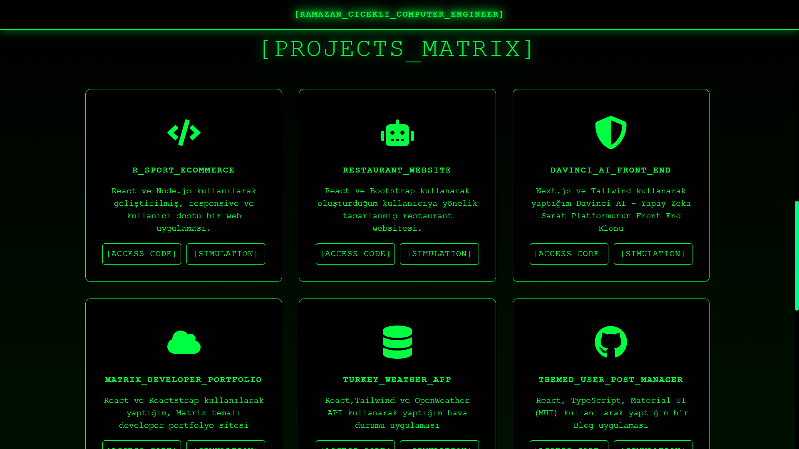
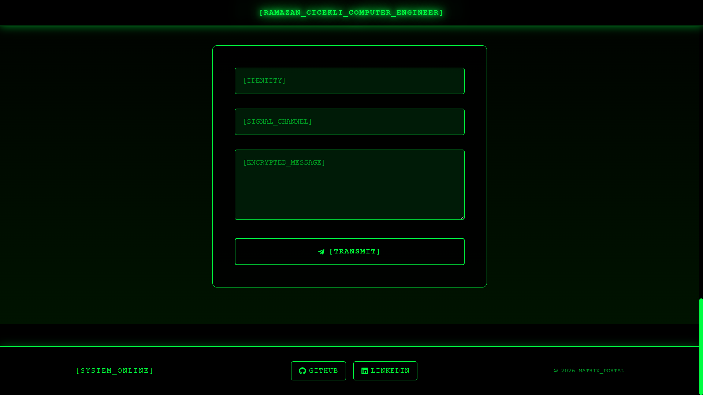

## 🟢 MATRIX_DEVELOPER_PORTFOLIO

> [SYSTEM_INITIALIZED]  
> Modern web teknolojileri ile geliştirilmiş, Matrix (cyberpunk) temalı geliştirici portfolyo uygulaması.

---

## 📸 SCREENSHOTS

| Matrix 1 | Matrix 2 |
|----------|----------|
|  |  |

| Matrix 3 | Matrix 4 |
|----------|----------|
|  |  |


## 🚀 CANLI DEMO

🔗 https://matrix-portfolio-v2-five.vercel.app/

---

## ⚙️ KULLANILAN TEKNOLOJİLER

- ⚛️ React
- 💡 JavaScript (ES6+)
- 🎨 Custom CSS (UI Framework kullanılmamıştır)
- 🌐 Vercel (Deployment)

❗ Not: Bu projede Bootstrap, Reactstrap gibi UI framework’ler kullanılmamıştır.  
Tüm arayüz tamamen **custom CSS** ile geliştirilmiştir.

---

## 🧠 ÖZELLİKLER

- 🟢 Matrix / Cyberpunk UI tasarımı
- 💻 Proje listeleme (GitHub + Live Demo)
- ⚡ Hover ve glow animasyonları
- 📱 Fully responsive yapı
- 🧩 Component-based mimari
- 🎯 Performans odaklı frontend

---

## 📁 PROJE YAPISI

```bash
src/
├── components/
│   ├── MyNav.jsx
│   ├── Projects.jsx
│   ├── Skills.jsx
│   ├── Contact.jsx
│   ├── Hero.jsx
│   └── Footer.jsx
├── App.js
├── index.js
└── styles.css

##🔧 KURULUM

Projeyi çalıştırmak için:

npm install
npm start


##👨‍💻 GELİŞTİRİCİ

Ramazan Çiçekli

GitHub: https://github.com/rcicekli
LinkedIn: https://www.linkedin.com/in/rcicekli/

##⚡ NOT

Bu proje modern frontend geliştirme yeteneklerini göstermek için hazırlanmış cyberpunk temalı bir portfolyo uygulamasıdır.
Projeyi beğendiysen ⭐ vermeyi unutma!
